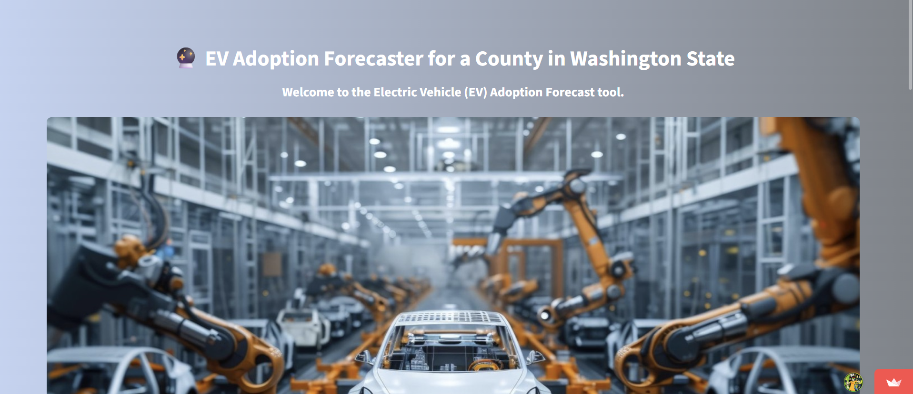

# 📈 EV Adoption Forecasting-EV Vehicle/Charging Demand Prediction

<h1 align="center">Hi 👋, I'm Raghav</h1>
<h3 align="center">Forecasting Electric Vehicle Growth in Washington State using Time Series Analysis</h3>

  
  
  

---

## 🚀 Live Demo

### [➡️ Click here to try the interactive EV Forecaster App!](https://evchargingprediction-tkfusxpyhmxkvkivseemmf.streamlit.app/)

Here's a quick look at the application in action:

  

---

## 📌 Project Overview

As electric vehicle (EV) adoption surges, urban planners need to anticipate infrastructure needs—especially charging stations. This project addresses this challenge by building and deploying a **time-series forecasting model** that predicts future EV adoption based on historical registration data from Washington State. The goal is to provide clear, actionable insights for infrastructure planning.

---

## ✨ Key Features

- 🔍 **In-Depth Analysis:** Analyzes historical trends in EV registration data from 2017 to 2024.
- 🤖 **Robust Forecasting Model:** Uses a Gradient Boosting model with lag features and rolling statistics to predict monthly EV registrations.
- 📊 **Interactive Dashboard:** A live web app built with Streamlit that allows users to:
    - Select a county to see a 3-year EV adoption forecast.
    - Compare the growth trends of up to 3 different counties side-by-side.
- 📈 **Clear Visualizations:** Generates dynamic plots showing the historical vs. forecasted cumulative EV counts.

---

## 🛠️ Tools & Technologies

  
  
  
  
  

---

## 🤝 Connect & Support

If you find this project interesting or useful, please consider giving it a ⭐️! You can also connect with me here:

  <a href="https://github.com/raghavj12345" target="_blank">
    
  </a>
  
  <a href="https://www.linkedin.com/in/raghav-joshi-687a02373" target="_blank">
    
  </a>

